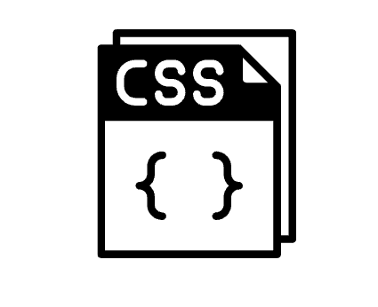
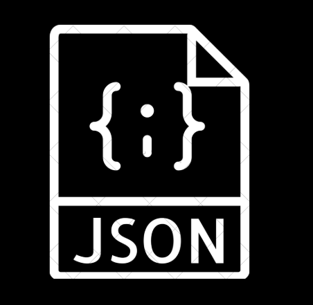
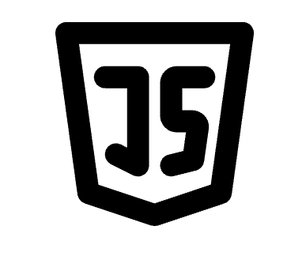
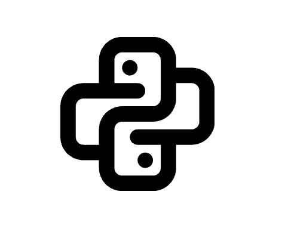
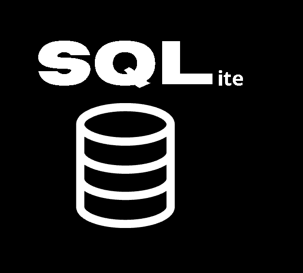
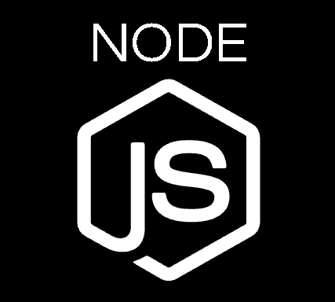
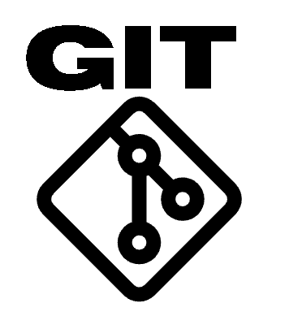

  
  \-------/
  

## Profile
Property                 | Data  
-------------------------|------
Language |                                                                                
Tool / Framework         |                                        
Domain Knownledge        |                 
CI / CD                  |          
Reach Me                 |   

## Blog Posts
<!-- blog star -->
* [\[好書推薦\] 主力的思維：日本神之散戶cis，發一條推特就能撼動日經指數](http://blog.zmcx16.moe/2020/09/cis.html) - 2020-09-02
* [\[技術雜談\] FB粉絲專頁機器人開發 - 股票抽籤小秘書 後續維護心得](http://blog.zmcx16.moe/2020/08/fb.html) - 2020-08-26
* [MahoMangaDownloaderVer11.9更新](http://blog.zmcx16.moe/2020/08/mahomangadownloaderver119.html) - 2020-08-23
* [\[個人網站開發\] 新增個人投資頁面](http://blog.zmcx16.moe/2020/08/blog-post.html) - 2020-08-09
* [\[GitHub Profile\] 客製化自己的Github個人頁面](http://blog.zmcx16.moe/2020/07/github-profile-github.html) - 2020-07-31
* [\[OCR+即時翻譯\] Capture2Text 軟體推薦 - 玩Gal Game or 生肉漫神器](http://blog.zmcx16.moe/2020/07/ocr-capture2text-gal-game-or.html) - 2020-07-29
* [MahoMangaDownloaderVer11.8更新](http://blog.zmcx16.moe/2020/07/mahomangadownloaderver118.html) - 2020-07-26
* [MahoMangaDownloaderVer11.7更新](http://blog.zmcx16.moe/2020/07/mahomangadownloaderver117.html) - 2020-07-19
* [MahoMangaDownloaderVer11.6 更新 (含Ver11.5)](http://blog.zmcx16.moe/2020/07/mahomangadownloaderver115.html) - 2020-07-10
* [\[讀書心得\] 老人詐欺：把老人當作目標，不僅是因為老人好騙。更是因為「那個世代」，壟斷最多財富](http://blog.zmcx16.moe/2020/07/blog-post_6.html) - 2020-07-06

<!-- blog end -->
More on [blog.zmcx16.moe](https://blog.zmcx16.moe/)

----
-----
Credits: [zmcx16](https://github.com/zmcx16)

Last Edited on: 03/09/2020
